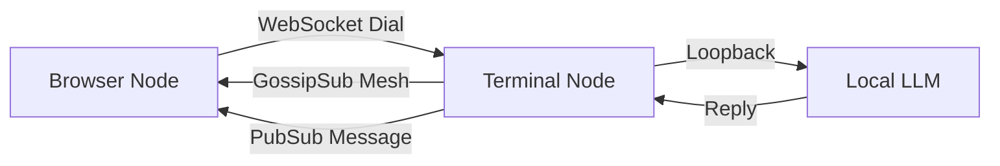

# LLMesh 🛸🌊

> **"Navigate the Decentralized Cosmos with Alien X"**

- A decentralized, browser-based P2P chat mesh where every peer sends encrypted pulses through libp2p’s GossipSub layer, and an embedded LLM (Ollama- local, Chatgpt-hosted) joins the mesh as its own node, weaving LLM intelligence directly into the peer network.
- A decentralized, browser-based chat platform powered by **libp2p** and an **Ollama**. 
- It bridges the gap between raw peer-to-peer protocols and a fun, interactive user experience.

---

## Why this exists
We wanted to prove that P2P doesn't have to be boring terminal logs. By combining **js-libp2p: universal-connectivity** with a local **LLM Agent**, we created a "living" mesh where your first peer is a cosmic entity that helps you flow. No central servers, just you, your peers, and the Forge of Creation.

## Features
- **Browser-to-Terminal Mesh**: Connect directly from your browser to a headless Node.js agent via WebSockets.
- **GossipSub Chat**: True decentralized messaging using pubsub topics.
- **Alien X Agent**: A local LLM (Ollama/Llama 3.2) that lives on the network, greets you, and chats with cosmic wisdom.
- **Visuals**: Ambient wave-flow UI, 3D-style loading warp, and reactive mesh feedback.

---

## Architecture Flow



1. **Browser** spawns a libp2p node (WebSocket transport).
2. **Terminal Agent** listens on TCP + WebSocket and bridges the LLM.
3. **Connect**: Browser dials Agent's `/ws` multiaddr.
4. **Mesh**: Gossipsub mesh forms; peers sync.
5. **Chat**: Messages flow over the mesh; Alien X replies via the Agent logic.

---

## Quick Start 🚀

### 1. Start the Agent (Terminal)
This is your gateway node. It runs the mesh and the LLM hook.
```bash
cd p2p-X/web/app
npm install
node index.js
```
*Keep this terminal open! Look for the line starting with:*
`[SYSTEM]   /ip4/127.0.0.1/tcp/xxxxx/ws/p2p/Qm...`

### 2. Start the AI (Optional but Cool)
For Alien X to talk back, run Ollama locally:
```bash
ollama serve
# Ensure you have llama3.2 pulled: ollama pull llama3.2
```
*(If skipped, chat still works P2P, but Alien X sleeps)*

### 3. Launch the UI (Browser)
```bash
cd p2p-X/web
npm install
npm run dev
```
Open `http://localhost:5173`.

### 4. Connect & Flow
1. Click **"LET'S FLOW"** on the landing page.
2. In the **"Target Agent Coordinates"** box, paste the **WS** address from Step 1.
   - ✅ Correct: `/ip4/127.0.0.1/tcp/xxxxx/ws/p2p/...`
   - ❌ Wrong: `/tcp/` only or `/tls/ws`.
3. Wait for **"MESH SYNCED"** status.
4. Alien X will greet you. Chat away! 🛸


### 5. Gratitude to Libp2p-verse.

-
-
-
-

---

*Built with Svelte, libp2p, and Cosmic Energy.*
