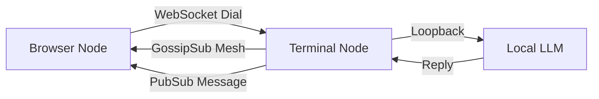

# LLMesh 🛸🌊

> **"Navigate the Decentralized Cosmos with Libp2p: Universal Connectivity workshop"**

<!--  -->


- A decentralized, browser-based P2P chat mesh where every peer sends encrypted pulses through libp2p’s GossipSub layer, and an embedded LLM (Ollama- local, Chatgpt-hosted) joins the mesh as its own node, weaving LLM intelligence directly into the peer network.
- Bridging the gap b/w raw peer-to-peer protocols and a fun, interactive user experience.

---

## Why this exists


To explore and tinker around the idea that P2P doesn't have to be just limited to boring terminal logs. By combining **js-libp2p: universal-connectivity** with a local **LLM Agent**, I tried to create a "living" mesh where your first peer is a cosmic entity(llm-persona) that helps you flow. No central servers, just you, your peers, and the Forge of Creation.

## Features
- **Browser-to-Terminal Mesh**: Connect directly from your browser to a headless Node.js agent via WebSockets.
- **GossipSub Chat**: True decentralized messaging using pubsub topics.
- **Alien X Agent**: A local LLM (Ollama/Llama 3.2) that lives on the network, greets you, and chats with cosmic wisdom.
- **Visuals**: Ambient wave-flow UI, 3D-style loading warp, and reactive mesh feedback.
  


---

## Architecture Flow



1. **Browser** spawns a libp2p node (WebSocket transport).
2. **Terminal Agent** listens on TCP + WebSocket and bridges the LLM.
3. **Connect**: Browser dials Agent's `/ws` multiaddr.
4. **Mesh**: Gossipsub mesh forms; peers sync.
5. **Chat**: Messages flow over the mesh; Alien X replies via the Agent logic.


https://github.com/user-attachments/assets/bff792b4-ea03-4841-b8c6-64d1b0960a78


---

## Quick Start 🚀

### 1. Start the Agent (Terminal-RECOMMENDED)
- This is your gateway node. It runs the mesh and the LLM hook.
```bash
cd p2p-X/web/app
npm install
node index.js
```
*Keep this terminal open! Look for the line starting with:*
`[SYSTEM]   /ip4/127.0.0.1/tcp/xxxxx/ws/p2p/Qm...`

> Note the ws:// address and port number, e.g., `/ip4/127.0.0.1/tcp/57704/ws/p2p/...`

### *Tip 💡:*
```
local running: use `ws` supported multiaddr to connect /ip4/127.0.0.1/tcp/56989/ws/p2p..
production url: use `webrtc-direct` addr /ip4/127.0.0.1/udp/56987/webrtc-direct/certhash/../p2p/..
```

### 2. Start the AI (Optional but Cool)
```bash
ollama serve
# Ensure you have llama3.2 pulled: ollama pull llama3.2
```
*(If skipped, chat still works P2P via terminal mode, but Alien X sleeps)*

### 2.1. Expose Ollama via ngrok (For Production/Vercel)

**Why ngrok on 11434 fixes CORS:**

1. **The Problem:**
   - Browser (HTTPS on Vercel) tries to call `http://127.0.0.1:11434` → CORS blocks it
   - Vercel serverless functions can't access `localhost` directly

2. **The Solution (Two-Part):**
   - **Part A:** Vercel API Proxy (`/api/ollama-proxy`) - Browser calls this (same origin, no CORS)
   - **Part B:** ngrok tunnel on 11434 - Vercel proxy forwards to ngrok URL (which tunnels to local Ollama)

3. **The Flow:**
   ```
   Browser (HTTPS) 
     → /api/ollama-proxy (same origin, no CORS ✅)
       → Vercel Serverless Function
         → ngrok tunnel (https://xyz789.ngrok.io)
           → Local Ollama (http://localhost:11434)
   ```

**Step-by-step:**

1. **Install ngrok** (if not already installed):
   ```bash
   # macOS
   brew install ngrok
   
   # Or download from https://ngrok.com/download
   ```

2. **Start ngrok tunnel for Ollama (Port 11434):**
   ```bash
   ngrok http 11434
   ```

3. **Copy the HTTPS Forwarding URL:**
   - Look for: `Forwarding  https://xyz789.ngrok.io -> http://localhost:11434`
   - Copy the `https://xyz789.ngrok.io` part

<!-- 4. **Set in Vercel Environment Variables:**
   - Go to Vercel Dashboard → Your Project → Settings → Environment Variables
   - Add: `OLLAMA_BASE_URL` = `https://xyz789.ngrok.io`
   - Redeploy your app

5. **Verify:**
   - The Vercel proxy (`/api/ollama-proxy.js`) reads `OLLAMA_BASE_URL` and forwards requests to it
   - Since it's a serverless function, it can access the ngrok URL (which tunnels to your local Ollama)

**Note:** For local development (`localhost:5173`), Ollama works directly without ngrok. ngrok is only needed for production deployments on Vercel. -->

### 3. Launch the UI (Browser)
```bash
cd p2p-X/web
npm install
npm run dev
```
Open `http://localhost:5173`.

### 4. Connect & Flow
1. Click **"LET'S FLOW"** on the landing page.
2. In the **"Target Agent Coordinates"** box, paste the **WS** address from Step 1.
   - ✅ Correct: `/ip4/127.0.0.1/tcp/xxxxx/ws/p2p/...`
   - ❌ Wrong: `/tcp/` only or `/tls/ws`.
3. Wait for **"MESH SYNCED"** status.
4. Alien X will greet you. Chat away! 🛸


### 5. Gratitude to Libp2p-verse.

- https://libp2p.io
- https://github.com/libp2p/universal-connectivity-workshop
- https://github.com/libp2p/js-libp2p
- https://github.com/libp2p/universal-connectivity

---

*Built with Svelte, libp2p, and Cosmic Energy.*
