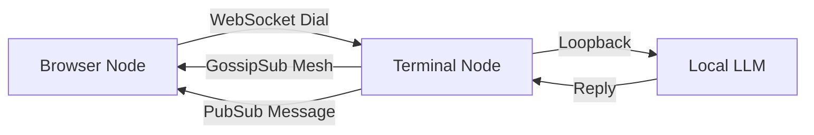

# LLMesh 🛸🌊   

> **Navigate the Decentralized Cosmos: P2P Chat with LLM Intelligence**

A browser-based P2P chat mesh where **LLM joins as a peer** via **UCEP extensions**, creating a living network where AI and humans chat together in a fully decentralized manner.


## What It Is 🌌

- **Decentralized Chat** - No servers, just peers talking directly
- **LLM as Extension** - AI assistant discoverable via UCEP protocol
- **Browser-to-Terminal** - Connect browser UI to headless agent node
- **GossipSub Mesh** - Real-time message broadcasting

## Why this exists
<!--  -->

- To explore and tinker around the idea that P2P doesn't have to be just limited to boring terminal logs. By combining **js-libp2p: universal-connectivity** with a local **LLM Agent**, I tried to create a "living" mesh where your first peer is a cosmic entity(llm-persona) that helps you flow.
-  No central servers, just you, your peers, and the Forge of Creation.

  
## Core Features

### 🛸 UCEP Extension System
- **Provider** - Terminal node exposes LLM as extension
- **Consumer** - Browser discovers and uses extensions dynamically
- **Protocol-Based** - Discover via Identify, execute via direct streams

### 💬 P2P Chat
- **GossipSub** - Decentralized message broadcasting
- **Encrypted** - Noise protocol for security
- **Real-time** - Instant message delivery

### 🤖 LLM Integration
- **Ollama** - Local LLM (default: llama3.2)
- **OpenAI** - Cloud fallback option
- **UCEP Extension** - Discoverable AI service


## Architecture Flow

```
┌─────────────┐                    ┌─────────────┐
│   Browser   │                    │  Terminal   │
│   (p2p.js)  │                    │ (index.js)  │
│             │                    │             │
│  UCEP       │◄──Identify─────────►│  UCEP       │
│  Consumer   │   Protocol          │  Provider  │
│             │                    │             │
│  ┌─────────┐│                    │  ┌─────────┐│
│  │GossipSub││◄───Mesh─────────────►│  │GossipSub││
│  └─────────┘│                    │  └─────────┘│
│             │                    │             │
│             │                    │  ┌─────────┐│
│             │                    │  │   LLM    ││
│             │                    │  │ Service  ││
│             │                    │  └─────────┘│
└─────────────┘                    └─────────────┘
```


```mermaid
graph LR
    User[Browser Node] -- WebSocket Dial --> Agent[Terminal Node]
    Agent -- GossipSub Mesh --> User
    Agent -- Loopback --> Ollama[Local LLM]
    Ollama -- Reply --> Agent
    Agent -- PubSub Message --> User
```

1. **Browser** spawns a libp2p node (WebSocket transport).
2. **Terminal Agent** listens on TCP + WebSocket and bridges the LLM.
3. **Connect**: Browser dials Agent's `/ws` multiaddr.
4. **Mesh**: Gossipsub mesh forms; peers sync.
5. **Chat**: Messages flow over the mesh; Alien X replies via the Agent logic.


### UCEP Extension Flow

```
1. Terminal Node
   └─> Registers LLM Extension
       Protocol: /uc/extension/alien-x-llm/1.0.0

2. Browser Connects
   └─> Identify Protocol Exchange
       Discovers: /uc/extension/alien-x-llm/1.0.0

3. Browser Requests Manifest
   └─> Fetches extension metadata (commands, description)

4. User Sends Message
   └─> Browser executes: chat <message>
       └─> Direct protobuf stream to terminal
           └─> LLM processes → Response
               └─> Returns to browser
```

- **Discovery** - Via Identify protocol
- **Manifest** - Extension metadata exchange
- **Execution** - Direct protobuf streams
- **Decoupled** - Extensions independent of chat


## Quick Start

https://github.com/user-attachments/assets/bff792b4-ea03-4841-b8c6-64d1b0960a78


### Prerequisites
- **Node.js** (v18+)
- **Ollama** ([Download](https://ollama.com/download)) - Optional but recommended
- [ChatGPT API key](https://platform.openai.com/api-keys)
- **Model**: `llama3.2` (auto-downloaded on first use)

### Step 1: Start Terminal Agent
```bash
cd libp2p-ai/p2p-X/web/app
npm install
node index.js
```
***Copy the `/ws` multiaddr** from output:**
`[SYSTEM]   /ip4/127.0.0.1/tcp/xxxxx/ws/p2p/Qm...`

> Note the ws:// address and port number, e.g., `/ip4/127.0.0.1/tcp/57704/ws/p2p/...`

### *Tip 💡:*
```
local running: use `ws` supported multiaddr to connect /ip4/127.0.0.1/tcp/56989/ws/p2p..
production url: use `webrtc-direct` addr /ip4/127.0.0.1/udp/56987/webrtc-direct/certhash/../p2p/..
```

### Step 2: Start Ollama (Optional)
```bash
ollama serve
# First time? Pull model: ollama pull llama3.2
```

### Step 3: Launch Browser UI
```bash
cd libp2p-ai/p2p-X/web
npm install
npm run dev
```

Open `http://localhost:5173`

### Step 4: Connect & Chat
1. Click **"LET'S FLOW"**
2. Paste the `/ws` multiaddr from Step 1
3. Wait for **"MESH SYNCED"**
4. **Alien X greets you** - Start chatting! 🛸

## Multiaddr Formats

| Context | Format | Example |
|---------|--------|---------|
| **Local** | `/ip4/127.0.0.1/tcp/XXXX/ws/p2p/...` | ✅ Use this |
| **Production** | `/ip4/.../udp/.../webrtc-direct/...` | HTTPS required |
| **Wrong** | `/tcp/...` or `/tls/ws/...` | ❌ Not supported |

## Requirements

### Local Setup
- ✅ Ollama running (`ollama serve`)
- ✅ Terminal agent running (`node index.js`)
- ✅ Browser UI running (`npm run dev`)
- ✅ Use `/ws` multiaddr format

### Production (Vercel)
- ⚠️ Requires `/webrtc-direct` multiaddr (HTTPS)
- ⚠️ LLM disabled (ngrok free tier limitations)
- 💡 **Best experience: Run locally with Ollama**

## Key Components

### Terminal Node (`app/index.js`)
- **UCEP Provider** - Registers LLM extension
- **P2P Gateway** - Bridges browser to mesh
- **Protocol Hub** - TCP, WS, WebRTC, Relay

### Browser Node (`src/lib/p2p.js`)
- **UCEP Consumer** - Discovers and uses extensions
- **GossipSub Client** - Chat messaging
- **Extension Manager** - Handles UCEP & GossipSub extensions

### LLM Extension (`app/llm-extension-provider.js`)
- **Extension Definition** - Commands, manifest
- **Command Handler** - Processes chat requests
- **LLM Integration** - Ollama/OpenAI calls

## Extension Commands

### LLM Extension (`alien-x-llm`)
```javascript
// In browser console
window.listExtension()
window.testExtension('alien-x-llm', 'chat', ['Hello!'])
window.testExtension('alien-x-llm', 'ping')
```

### Echo Extension (`echo`)
```javascript
window.testExtension('echo', 'echo', ['test message'])
window.testExtension('echo', 'ping')
```

## What Makes It Special

✨ **LLM as Peer** - AI joins the mesh, not just responds  
✨ **UCEP Discovery** - Extensions found automatically  
✨ **No Servers** - Pure P2P, no central authority  
✨ **Extensible** - Add new extensions easily  
✨ **Real-time** - Instant message delivery  

## Resources

- **libp2p Docs**: https://docs.libp2p.io/
- **Universal Connectivity Workshop**: https://github.com/libp2p/universal-connectivity-workshop
- **js-libp2p**: https://github.com/libp2p/js-libp2p

---

**Built with Svelte, Libp2p, and Cosmic Energy imbibed from Universal Connectivity Workshop.** ❤️‍🔥🚀
